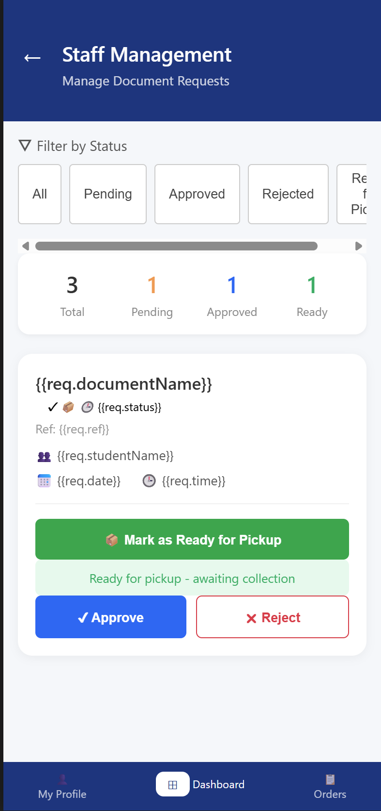
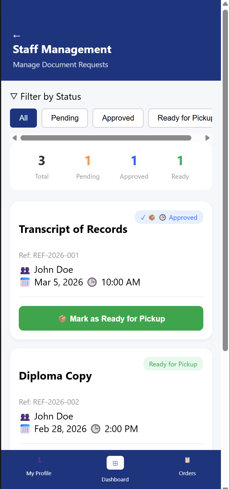
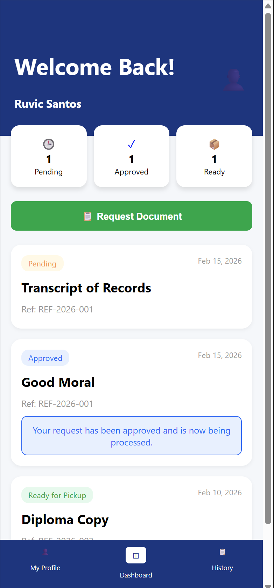
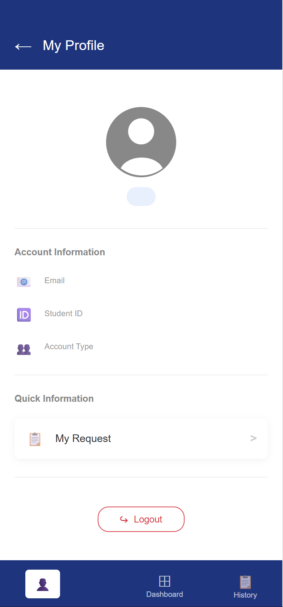

## Moncatar

#### Framework: Angular JS

#### Module: Document Request

#### Installation:

To replicate and run this project follow the following steps using Windows Powershell:

```bash
winget install OpenJS.NodeJS.LTS

nvm install lts
nvm use lts

git clone [https://github.com/francesmoncatar/alumni-hub-app](https://github.com/francesmoncatar/alumni-hub-app)

cd alumni-hub-app

```

#### AI Tools:

- Google Gemini

#### Prompt:

(1st) Prompt: Create a prompt that allows me to clearly communicate to AI to recreate my design using the references I will be giving throughout. I am working with angularjs, on vscode. Make it clean and specific.

(2nd) Prompt: Role: Act as a Senior Frontend Developer specializing in legacy AngularJS (v1.8) and modern CSS layouts.

Task: Recreate the attached reference image as a fully functional single-page website.

Technical Stack:Framework: AngularJS (v1.8.x) for all data binding and logic.

Structure: Clean, semantic HTML5.

Styling: External CSS file using modern layout techniques like Flexbox or Grid to ensure the layout matches the image perfectly.

Environment: Code should be optimized for VS Code, organized into index.html, app.js, and styles.css.Visual 
Specifics from Reference.

Color Palette: Use the exact colors from the image.

Layout: [Describe the layout, e.g., "A centered hero section with a three-column feature grid below"].

Typography: Suggest font pairings that closely match the reference (e.g., [Sans-serif for headings, Serif for body]).

Components: Create AngularJS components/directives for wherever you feel is necessary/fits the code.

Functionality Requirements:The buttons should be interactive, and pages should be connected if possible.Use ng-repeat to dynamically render the [List of items, e.g., team members or services] based on an array in the controller.

Output format: Please provide the full code for index.html, app.js, and style.css in separate, copyable code blocks.


PWA TRANSFORMATION SECTION (1st Prompt):

(Continuation from my Activity #14 AI Prompt and History)

I have an AngularJS document request system. Help me transform it into a PWA (Progressive Web App). Provide a manifest.json with university branding, a service worker for offline caching, and the registration script. Ensure the service worker handles my js/ and images/ folders so the app works without internet.

#### Screenshots




